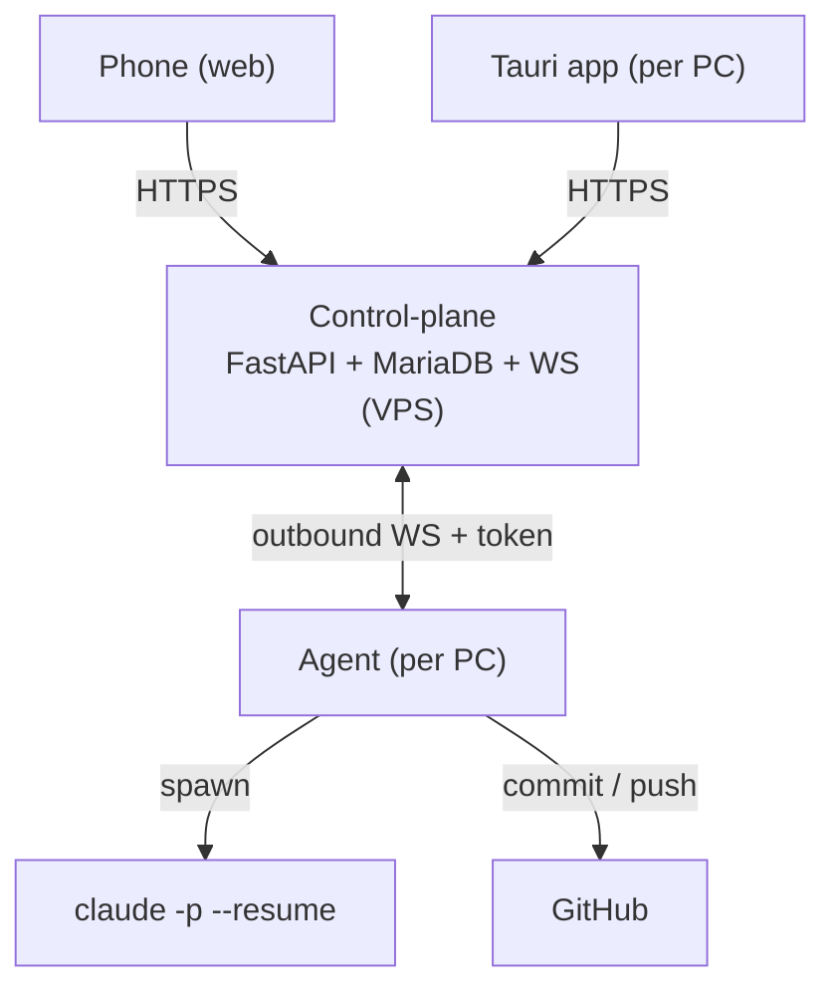

# NightForge

**Autonomous overnight worker manager for Claude Code**

NightForge makes Claude Code work on its own while you sleep or are away. Queue prompts
per project, pick which of your machines runs the job (desktop or laptop), and let it drain
the queue prompt by prompt — automatically resuming after each 5-hour quota reset, committing
regularly, and pushing a dedicated branch to GitHub. A quota planner tells you, before you
launch, when each quota will run and when a fresh one will be free again, so you can burn your
Claude Max allowance overnight instead of losing it. Everything is drivable from any device —
desktop app or phone browser — **without a VPN**, because the machines connect out to your VPS.

> **Project status:** scaffolded. The monorepo (`api/`, `web/`, `agent/`), CI workflows and
> Docker Compose are in place; business logic is stubbed where noted. Full spec:
> [`ARCHITECTURE.md`](./ARCHITECTURE.md), conventions: [`STANDARDS_CODE_ET_ARCHITECTURE.md`](./STANDARDS_CODE_ET_ARCHITECTURE.md).

## How it works

Three cooperating pieces (only the **agent** is new versus a classic web app):

- **Control-plane** (on the VPS) — the only publicly reachable component. Holds projects,
  queues, runs, logs and machine registry; serves the web UI for your phone.
- **Agent** (on each PC) — opens an **outbound** WebSocket to the VPS (no inbound ports),
  spawns `claude` locally in **Max subscription mode**, watches the quota, commits & pushes.
- **UI** (web + desktop) — one Nuxt app, served on the VPS for the browser/phone and packaged
  as a Tauri desktop app for each PC.



### The quota planner

Before you sleep, pick a **machine**, one or more **projects**, and a **number of quotas**.
NightForge estimates a timeline, e.g. launching at 23:00 with 2 quotas:

- Quota 1: started **23:00** → resets **~04:00**
- Quota 2: started **~04:00** → resets **~09:00**
- **Fresh quota available: ~09:00**

Claude Max uses a **rolling** 5-hour window, so quota 2/3 times are estimates and are
**re-anchored live** using Claude's real reset data. Weekly caps (especially Opus) are shown
too, to avoid hitting a wall after several full nights.

## Architecture

```
.
├── api/     # FastAPI control-plane (projects, queues, runs, quota, WebSocket) + MariaDB
├── web/     # Nuxt 4 dashboard — Tauri 2 desktop shell (web + phone + desktop, one UI)
└── agent/   # Python agent — runs on each PC, drives Claude Code locally
```

Full design, data model, error handling and open decisions:
[`ARCHITECTURE.md`](./ARCHITECTURE.md).

## Stack

| Layer        | Technology                                                        |
| ------------ | ---------------------------------------------------------------- |
| Frontend     | Nuxt 4, Vue 3.5, TypeScript (strict), Pinia, Nuxt UI v4, TailwindCSS v4 |
| Control-plane| FastAPI, Pydantic v2, SQLAlchemy, MariaDB, WebSocket             |
| Agent        | Python (subprocess for `claude` & `git`, httpx, websockets)     |
| Desktop      | Tauri 2 + static Nuxt generate (signed auto-updater, CI)        |
| Automation   | Claude Code CLI (`claude -p`, `--resume`) in Max subscription mode |
| Hosting      | VPS (Debian OVH) via Docker                                      |

## Prerequisites

- Node.js 22+
- Python 3.11+
- Rust stable (desktop builds only)
- **Claude Code installed and logged in (Claude Max)** on every PC that runs the agent
- A VPS with Docker for the control-plane

## Installation

```bash
# Frontend
cd web
npm install

# Control-plane
cd ../api
pip install -r requirements.txt

# Agent (on each PC)
cd ../agent
pip install -r requirements.txt
```

### Environment

`web/.env`:

```env
NUXT_PUBLIC_API_BASE=http://localhost:8010
```

`agent/.env`:

```env
NF_API_BASE=http://localhost:8010     # VPS URL in prod
NF_AGENT_TOKEN=<per-machine token>    # issued once in the dashboard (Machines → add)
NF_CLAUDE_BIN=claude                  # path to the Claude CLI if not on PATH
NF_TICK_SECONDS=30
```

`api/.env` — control-plane config (DB, auth, secrets). Copy from `api/.env.example`.

## Development

```bash
# 0. Start MariaDB + phpMyAdmin
docker compose up -d          # DB on :3311, phpMyAdmin on :7501

# 1. Control-plane (create api/.env from api/.env.example first)
cd api
python init_db.py             # create schema + seed admin (contact@dibodev.fr / admin123)
python run_dev.py             # http://localhost:8010 (Swagger: /docs)

# 2. Web
cd ../web
npm install
npm run dev                   # http://localhost:3003

# 3. Agent (needs NF_AGENT_TOKEN from the dashboard → Machines)
cd ../agent
python -m nightforge_agent
```

From the repo root, `npm install` then `npm run dev` boots the API and web together
(`concurrently`).

### Ports locaux (éviter les conflits avec DevLeadHunter)

| Service | NightForge | DevLeadHunter |
|---------|------------|---------------|
| API | **8010** | **8000** |
| Web | **3003** | **3000** |
| MariaDB | **3311** | (propre stack) |

## Desktop (Tauri)

```bash
cd web
npm run tauri:dev         # dev shell on port 1420
npm run tauri:build       # local release build
```

Desktop builds use `NUXT_DESKTOP_BUILD=1` (SSR off, static preset) and talk to the remote
control-plane via `NUXT_PUBLIC_API_BASE`. Launching the packaged app **auto-starts the local
agent** as a Tauri sidecar (see `web/src-tauri/src/lib.rs`) — nothing else to run. CI release
workflow: `.github/workflows/desktop-release.yml` (Windows, auto-updater) also builds the agent
sidecar with PyInstaller.

**Local desktop prerequisites** (once):

- App icons — generate them from a logo: `cd web && npm run tauri icon path/to/logo.png`
  (writes `src-tauri/icons/*`, which `tauri.conf.json` expects).
- Agent sidecar for a local `tauri:build` — build it into
  `web/src-tauri/binaries/nightforge-agent-<target-triple>.exe` (in `tauri:dev` the agent is
  started directly by `scripts/dev-desktop.mjs`, so no binary is needed).

Required GitHub secrets (same pattern as DevLeadHunter):

- `TAURI_UPDATER_PUBKEY`
- `TAURI_SIGNING_PRIVATE_KEY`
- `TAURI_SIGNING_PRIVATE_KEY_PASSWORD`
- `NUXT_PUBLIC_API_BASE`

## Safety

Autonomous runs use `--dangerously-skip-permissions`, so guardrails are mandatory: work only
inside the project's repo on a dedicated `night/YYYY-MM-DD` branch, an **error budget**
(auto-stop after N failures), a command allowlist, and a **kill switch** from the UI. Git is
the safety net. The agent never stores an API key — it uses your Claude Max session only.

## Code quality

```bash
cd web
npm run lint              # prettier + eslint + vue-tsc
npm run lint:fix
```

Pre-commit hook (root): `npm --prefix web run lint`.

## License

MIT
