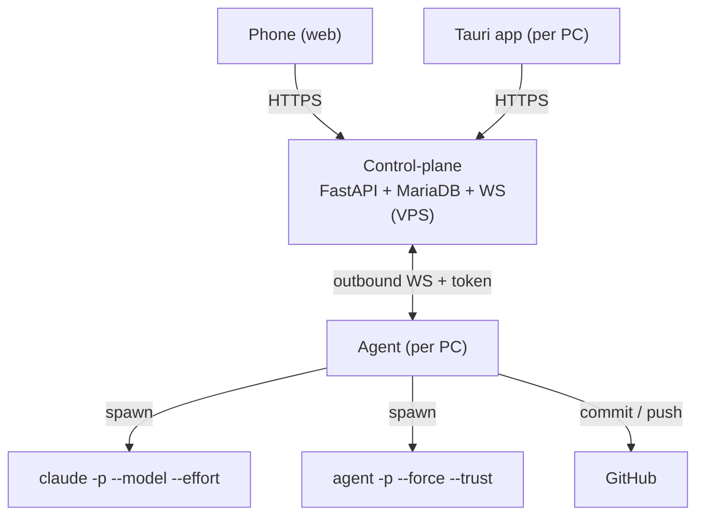

# NightForge

**Autonomous overnight worker manager for Claude Code & Cursor Agent**

NightForge makes Claude Code (and Cursor Agent) work on their own while you sleep or are
away. Queue prompts per project with the provider, model and effort you want, pick which of
your machines runs the job, and let it drain the queue prompt by prompt — automatically
resuming after each Claude Max 5-hour quota reset, committing regularly, and pushing a
dedicated branch to GitHub. A quota planner tells you, before you launch, when each Claude
quota will run and when a fresh one will be free again. Everything is drivable from any
device — desktop app or phone browser — **without a VPN**, because the machines connect out
to your VPS.

> **Project status:** V2. Multi-provider (Claude Code + Cursor Agent), prompt notebook with
> on-the-fly launches, agent lifecycle tied to the desktop app. Spec:
> [`docs/ARCHITECTURE.md`](./docs/ARCHITECTURE.md), conventions:
> [`docs/STANDARDS_CODE_ET_ARCHITECTURE.md`](./docs/STANDARDS_CODE_ET_ARCHITECTURE.md),
> checklist: [`docs/V2_PLAN.md`](./docs/V2_PLAN.md).

## How it works

Three cooperating pieces (only the **agent** is new versus a classic web app):

- **Control-plane** (on the VPS) — the only publicly reachable component. Holds projects,
  queues, runs, logs and machine registry; serves the web UI for your phone.
- **Agent** (on each PC) — opens an **outbound** WebSocket to the VPS (no inbound ports),
  spawns `claude` or Cursor `agent` locally, watches the Claude quota, commits & pushes.
  **Started with the Tauri desktop app and stopped when you close it** — nothing runs in
  the background when NightForge is closed.
- **UI** (web + desktop) — one Nuxt app, served on the VPS for the browser/phone and packaged
  as a Tauri desktop app for each PC.



### Prompt notebook (File d'attente)

The queue is a **prompt notebook**: jot ideas while another run is busy. Create a
project from the project picker by pasting the **local git clone path** on your machine
(folder name + GitHub remote are detected via the agent when online). By default
**push to main** is enabled (no `night/YYYY-MM-DD` branch); turn it off in project
settings to keep the night-branch workflow. Each entry can optionally specify:

- **Provider** — Claude Code or Cursor
- **Model** — Sonnet / Opus / Fable / Grok 4.5 / Composer 2.5 / …
- **Effort** — low → max (Extra = `xhigh`), when the model supports it
- **Fast** — off by default (Composer 2.5 only needs this toggle)

Daily defaults are pre-filled (Sonnet→max, Opus→high, Fable→extra, Grok 4.5→high).

**Aide prompts IA** (queue → **Aide IA**): paste free-form ideas / keywords;
NightForge splits them into ready prompts. When a machine is online it uses **Composer 2.5**,
falling back to **Claude Haiku** if Cursor is unavailable; otherwise a local heuristic.
Provider/model are pre-filled on each queue item.

**Two ways to run prompts:**

| Mode | Where | What you get |
|------|--------|--------------|
| **Lancement** (`kind=quick`) | File d'attente → play / sélection | Lightweight UI: machine, prompts, logs — no night quota planner |
| **Nuit** (`kind=night`) | Composer | Full overnight session: multi-message sequence, quota timeline, budget |

Copy a prompt to the clipboard when you are at the machine, launch one or many from the
queue while present, or compose a full night when you step away.

### The quota planner (Claude Max)

Before you sleep, pick a **machine**, one or more **projects**, and a **number of quotas**.
NightForge estimates a timeline, e.g. launching at 23:00 with 2 quotas:

- Quota 1: started **23:00** → resets **~04:00**
- Quota 2: started **~04:00** → resets **~09:00**
- **Fresh quota available: ~09:00**

Claude Max uses a **rolling** 5-hour window, so quota 2/3 times are estimates and are
**re-anchored live**. Cursor messages in a mixed run do **not** consume this Claude planner.
Quick launches skip the planner UI (they still run through the same agent).

### Dashboard — Utilisation

The dashboard shows **account-level** remaining quotas (same Claude / Cursor login across
machines): Claude Max **5 h** + **weekly** buckets when available, and Cursor plan bars
(Composer/Auto, other models) when the desktop agent can read the local Cursor session.
If Cursor usage cannot be read, that section is hidden.

### Multi-comptes Cursor

Page **Comptes Cursor** (`/dashboard/cursor-accounts`) — vault chiffré (Fernet /
`ENCRYPTION_KEY`) : email + mot de passe (rappel), connexion via navigateur par défaut
(`agent login` / session IDE), tokens en mode **Avancé**. Refresh re-fetch tous les
comptes. Avant chaque prompt Cursor, l’agent choisit le compte à moyenne Auto+API la
plus basse.

## Architecture

```
.
├── api/     # FastAPI control-plane (projects, queues, runs, quota, WebSocket) + MariaDB
├── web/     # Nuxt 4 dashboard — Tauri 2 desktop shell (web + phone + desktop, one UI)
├── agent/   # Python agent — runs on each PC, drives Claude Code / Cursor Agent locally
└── docs/    # Architecture, deployment, standards, V2 checklist (README stays at root)
```

Full design, data model, error handling and open decisions:
[`docs/ARCHITECTURE.md`](./docs/ARCHITECTURE.md).

Other docs (all under [`docs/`](./docs/)):

- [`docs/DEPLOYMENT.md`](./docs/DEPLOYMENT.md) — VPS / CI secrets
- [`docs/STANDARDS_CODE_ET_ARCHITECTURE.md`](./docs/STANDARDS_CODE_ET_ARCHITECTURE.md) — coding conventions
- [`docs/V2_PLAN.md`](./docs/V2_PLAN.md) — V2 checklist

## Stack

| Layer        | Technology                                                        |
| ------------ | ---------------------------------------------------------------- |
| Frontend     | Nuxt 4, Vue 3.5, TypeScript (strict), Pinia, Nuxt UI v4, TailwindCSS v4 |
| Control-plane| FastAPI, Pydantic v2, SQLAlchemy, MariaDB, WebSocket             |
| Agent        | Python (subprocess for `claude` / `agent` & `git`, httpx, websockets) |
| Desktop      | Tauri 2 + static Nuxt generate (signed auto-updater, CI)        |
| Automation   | Claude Code CLI + Cursor Agent CLI (headless)                     |
| Hosting      | VPS (Debian OVH) via Docker                                      |

## Prerequisites

- Node.js 22+
- Python 3.11+
- Rust stable (desktop builds only)
- **Claude Code installed and logged in (Claude Max)** on every PC that runs Claude jobs
- **Cursor Agent CLI** (`agent`) installed and logged in for Cursor jobs
- A VPS with Docker for the control-plane

## Installation

```bash
# Frontend
cd web
npm install

# Control-plane
cd ../api
pip install -r requirements.txt

# Agent (on each PC)
cd ../agent
pip install -r requirements.txt
```

### Environment

`web/.env`:

```env
NUXT_PUBLIC_API_BASE=http://localhost:8010
```

`agent/.env`:

```env
NF_API_BASE=http://localhost:8010     # VPS URL in prod
NF_AGENT_TOKEN=<per-machine token>    # issued once in the dashboard (Machines → add)
NF_CLAUDE_BIN=claude                  # path to the Claude CLI if not on PATH
NF_CURSOR_BIN=agent                   # path to the Cursor Agent CLI if not on PATH
NF_TICK_SECONDS=60                    # idle heartbeat
NF_TICK_SECONDS_WORKING=30            # heartbeat while a run is active
```

`api/.env` — control-plane config (DB, auth, secrets). Copy from `api/.env.example`.

## Development

```bash
# 0. Start MariaDB + phpMyAdmin
docker compose up -d          # DB on :3311, phpMyAdmin on :7501

# 1. Control-plane (create api/.env from api/.env.example first)
cd api
python init_db.py             # create schema + seed admin (contact@dibodev.fr / admin123)
python run_dev.py             # http://localhost:8010 (Swagger: /docs)

# 2. Web
cd ../web
npm install
npm run dev                   # http://localhost:3003

# 3. Agent (needs NF_AGENT_TOKEN from the dashboard → Machines)
cd ../agent
python -m nightforge_agent
```

From the repo root, `npm install` then `npm run dev` boots the API and web together
(`concurrently`).

### Ports locaux (éviter les conflits avec DevLeadHunter)

| Service | NightForge | DevLeadHunter |
|---------|------------|---------------|
| API | **8010** | **8000** |
| Web | **3003** | **3000** |
| MariaDB | **3311** | (propre stack) |

## Desktop (Tauri)

```bash
cd web
npm run tauri:dev         # dev shell on port 1420
npm run tauri:build       # local release build
```

Desktop builds use `NUXT_DESKTOP_BUILD=1` (SSR off, static preset) and talk to the remote
control-plane via `NUXT_PUBLIC_API_BASE`. Launching the packaged app **auto-starts the local
agent** as a Tauri sidecar and **force-kills it (process tree) on close** — verify with
`Get-Process nightforge-agent` after quitting. CI release workflow:
`.github/workflows/desktop-release.yml` (Windows, auto-updater) also builds the agent
sidecar with PyInstaller.

**Local desktop prerequisites** (once):

- App icons — generate them from a logo: `cd web && npm run tauri icon path/to/logo.png`
  (writes `src-tauri/icons/*`, which `tauri.conf.json` expects).
- Agent sidecar for a local `tauri:build` — build it into
  `web/src-tauri/binaries/nightforge-agent-<target-triple>.exe`. For `tauri:dev`,
  `scripts/dev-desktop.mjs` auto-creates a **stub** sidecar (Tauri requires the file at
  compile time) and starts the real agent with `python -m nightforge_agent`; the Rust app
  skips spawning the sidecar in `cfg(dev)`.

Required GitHub secrets (same pattern as DevLeadHunter):

- `TAURI_UPDATER_PUBKEY`
- `TAURI_SIGNING_PRIVATE_KEY`
- `TAURI_SIGNING_PRIVATE_KEY_PASSWORD`
- `NUXT_PUBLIC_API_BASE`

## Safety

Autonomous runs use `--dangerously-skip-permissions` (Claude) or `--force --trust`
(Cursor), so guardrails are mandatory: work only inside the project's repo (either
directly on `main` when `push_to_main` is on, or on a dedicated `night/YYYY-MM-DD`
branch), an **error budget** (auto-stop after N failures), and a **kill switch** from the
UI. Git is the safety net. The agent never stores an Anthropic API key — it uses your
Claude Max session only.

## Code quality

```bash
cd web
npm run lint              # prettier + eslint + vue-tsc
npm run lint:fix
```

Pre-commit hook (root): `npm --prefix web run lint`.

## License

MIT
