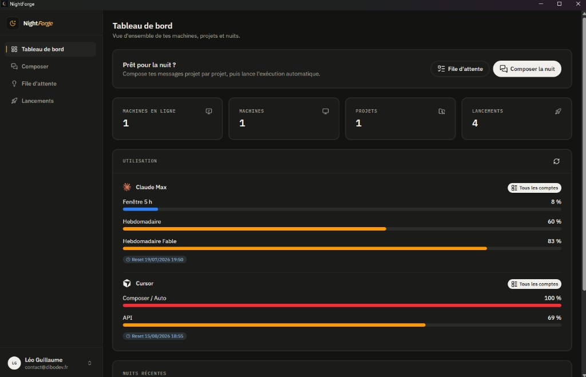
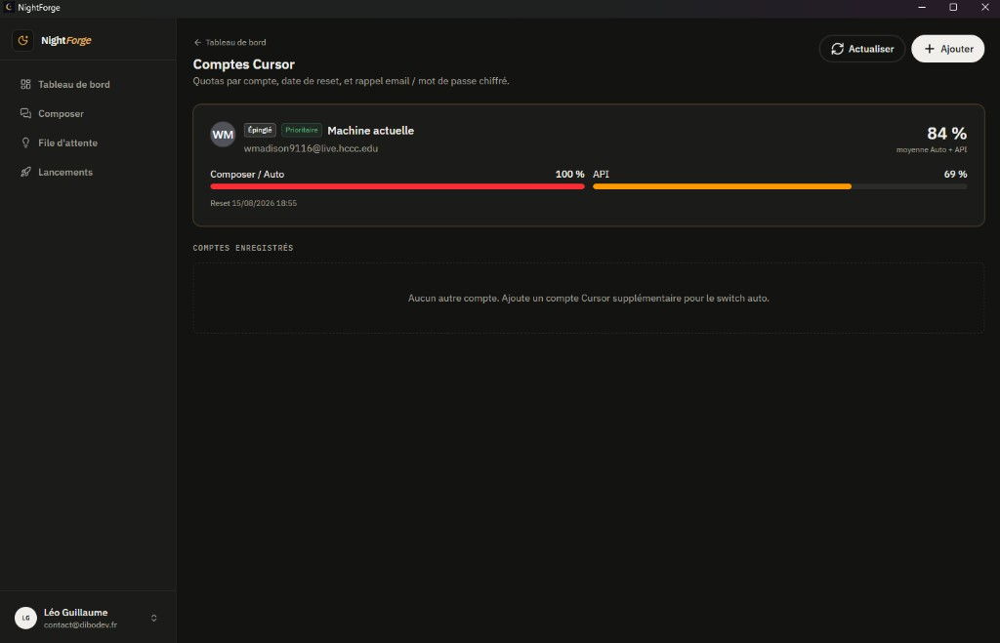
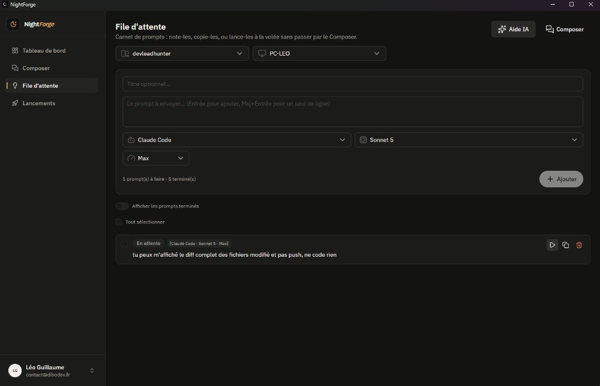
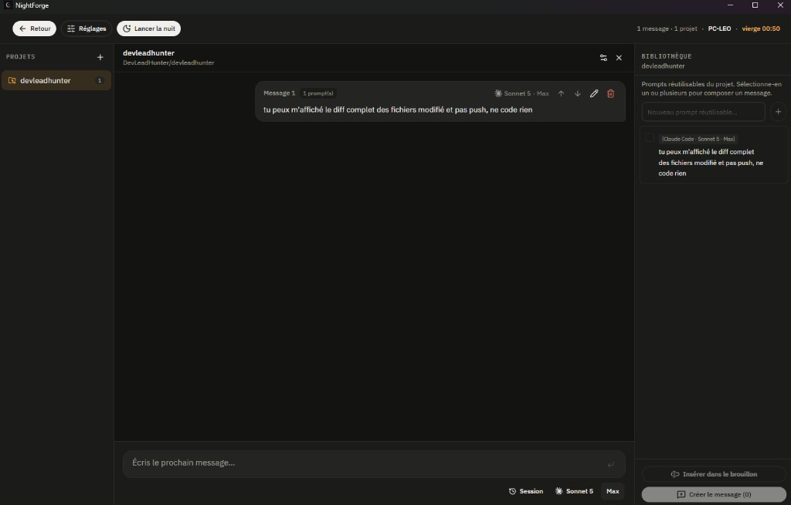
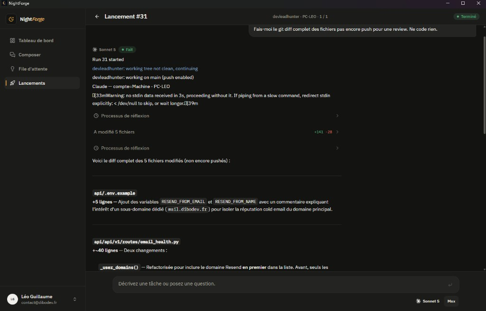
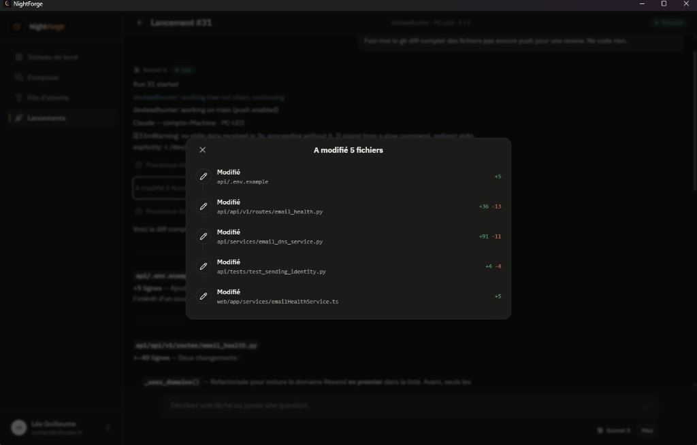
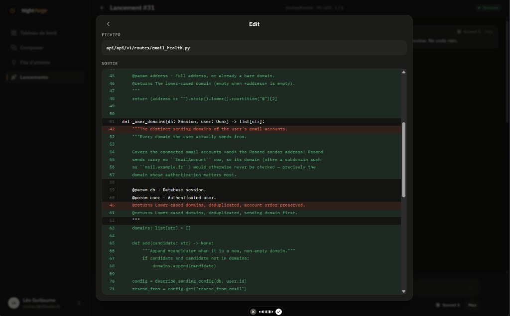
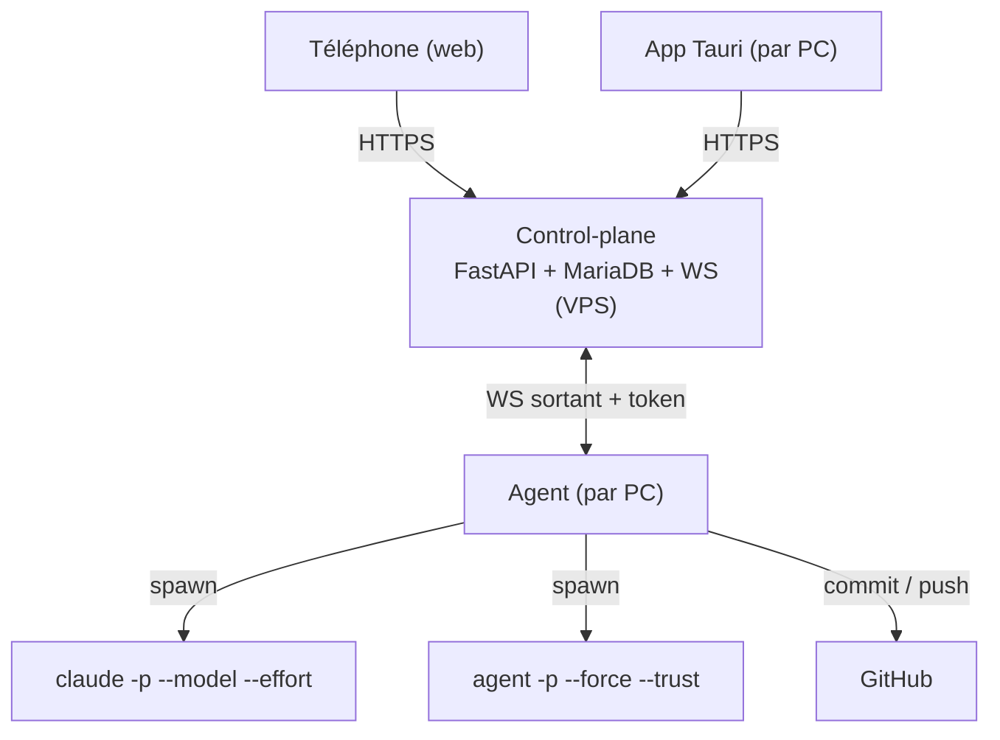

<p align="center">
  
</p>

<h1 align="center">NightForge</h1>

<p align="center">
  <strong>Gestionnaire autonome de workers IA pour Claude Code &amp; Cursor Agent</strong><br />
  Lance des prompts sur tes projets pendant que tu dors — depuis ton téléphone, sans VPN.
</p>

<p align="center">
  <a href="#fonctionnalités">Fonctionnalités</a> ·
  <a href="#comment-ça-marche">Architecture</a> ·
  <a href="#installation">Installation</a> ·
  <a href="#développement">Développement</a>
</p>

---

NightForge fait tourner **Claude Code** et **Cursor Agent** en autonomie sur tes machines. Tu files une file de prompts par projet (provider, modèle, effort), tu choisis quelle machine exécute quoi, et l'agent enchaîne les tâches — en reprenant automatiquement après chaque reset de quota, en commitant régulièrement et en poussant sur Git. Tout est pilotable depuis **n'importe quel appareil** (app desktop ou navigateur mobile) : démarre tes PCs, ouvre NightForge, puis contrôle tout depuis ton téléphone.

> **Statut du projet :** V2 — multi-provider, multi-comptes, multi-machines, review de code intégrée.  
> Spec : [`docs/ARCHITECTURE.md`](./docs/ARCHITECTURE.md) · Conventions : [`docs/STANDARDS_CODE_ET_ARCHITECTURE.md`](./docs/STANDARDS_CODE_ET_ARCHITECTURE.md) · Checklist : [`docs/V2_PLAN.md`](./docs/V2_PLAN.md)

## Aperçu

| Tableau de bord | Comptes Cursor |
|:---:|:---:|
|  |  |

| File d'attente | Composer |
|:---:|:---:|
|  |  |

| Lancement |
|:---:|
|  |

| Review — fichiers modifiés | Review — diff détaillé |
|:---:|:---:|
|  |  |

## Fonctionnalités

### Multi-provider : Claude Code & Cursor Agent

Chaque prompt peut cibler **Claude Code** ou **Cursor Agent**. Tu choisis le **modèle** (Sonnet, Opus, Fable, Grok 4.5, Composer 2.5…), le niveau d'**effort** (low → max, Extra = `xhigh` quand supporté) et le mode **Fast** (utile surtout pour Composer 2.5). Les valeurs par défaut quotidiennes sont pré-remplies (Sonnet→max, Opus→high, Fable→extra, Grok 4.5→high).

### Multi-comptes & switch automatique

- **Comptes Claude** (`/dashboard/claude-accounts`) — ajoute autant de comptes Claude Max que tu veux, consulte les quotas (fenêtre 5 h, hebdo…) et laisse l'agent **basculer automatiquement** vers le compte le moins chargé quand un quota est plein.
- **Comptes Cursor** (`/dashboard/cursor-accounts`) — même principe : vault chiffré (Fernet / `ENCRYPTION_KEY`), connexion via navigateur (`agent login`), tokens en mode Avancé. Avant chaque prompt Cursor, l'agent choisit le compte à **moyenne Auto+API la plus basse**.

Le tableau de bord affiche l'utilisation agrégée de tous tes comptes (barres Claude Max + Cursor) avec les dates de reset.

### Multi-machines & exécution parallèle

Enregistre **autant de machines que tu veux** (un clic depuis l'app desktop Tauri). Lance des prompts **en parallèle sur plusieurs PCs** — chaque machine exécute son propre agent via une connexion WebSocket sortante vers ton VPS (pas de ports entrants, pas de VPN).

### Projets : path local & détection Git auto

Pour ajouter un projet, colle simplement le **chemin du clone local** sur la machine. NightForge détecte automatiquement le nom du dossier, le remote GitHub et la branche de base via l'agent. Tu peux ensuite choisir :

| Option | Comportement |
|--------|--------------|
| **Push sur `main` activé** (défaut) | L'IA commit et push directement sur `main`. |
| **Push sur `main` désactivé** | NightForge crée une branche versionnée `night/YYYY-MM-DD` ; tu review et push toi-même. |

Le push automatique par l'IA est activable/désactivable à tout moment dans les réglages du projet.

### File d'attente — carnet de prompts

La **File d'attente** est un carnet de prompts réutilisables : note tes idées pendant qu'un autre run tourne, copie-les au presse-papier, ou lance-les à la volée. Chaque entrée peut spécifier provider, modèle, effort, fast et la machine cible.

**Aide prompts IA** (bouton **Aide IA** dans la file) : colle un pavé d'idées ou des mots-clés — NightForge les découpe (règles plan-de-session), rédige les prompts et choisit le meilleur modèle **Cursor ou Claude** pour chaque item. Ordre : machine agent en ligne → **Groq** (si `GROQ_API_KEY`) → heuristique locale.

### Composer — sessions de nuit

Le **Composer** permet de construire une séquence multi-messages par projet, avec la **bibliothèque de prompts** réutilisables, le planificateur de quotas Claude Max et le lancement d'une **nuit** complète.

### Review de code intégrée

Pendant et après chaque lancement, NightForge affiche les **fichiers modifiés** avec le décompte `+/-` lignes. Ouvre la feuille de review pour parcourir chaque diff ligne par ligne — idéal pour valider le travail de l'IA avant de merger ou de push.

| Fichiers modifiés | Diff détaillé |
|:---:|:---:|
|  |  |

### Contrôle à distance

Démarre tes machines, lance l'app desktop (qui démarre l'agent local), puis **pilote tout depuis ton téléphone** via le navigateur : ajouter des prompts, lancer la file d'attente, composer une nuit, suivre les logs en direct. Les machines se connectent **en sortie** vers ton VPS — aucun VPN requis.

## Comment ça marche

Trois briques coopèrent (seul l'**agent** est nouveau par rapport à une web app classique) :

| Composant | Rôle |
|-----------|------|
| **Control-plane** (VPS) | Seul composant public. Projets, files, runs, logs, registre des machines ; sert l'UI web pour le téléphone. |
| **Agent** (chaque PC) | WebSocket **sortant** vers le VPS, spawn `claude` ou `agent` localement, surveille les quotas, commit & push. **Démarré avec l'app Tauri, arrêté à la fermeture** — rien ne tourne en arrière-plan quand NightForge est fermé. |
| **UI** (web + desktop) | Une app Nuxt, servie sur le VPS (navigateur/téléphone) et packagée en app Tauri desktop par PC. |



### Deux modes de lancement

| Mode | Où | Ce que tu obtiens |
|------|-----|-------------------|
| **Lancement rapide** (`kind=quick`) | File d'attente → play / sélection | UI légère : machine, prompts, logs — sans planificateur de quotas |
| **Nuit** (`kind=night`) | Composer | Session complète : séquence multi-messages, timeline quotas, budget |

### Planificateur de quotas (Claude Max)

Avant de partir dormir, choisis une **machine**, un ou plusieurs **projets** et un **nombre de quotas**. NightForge estime une timeline (ex. lancement à 23h avec 2 quotas : quota 1 ~04h, quota 2 ~09h). Claude Max utilise une fenêtre glissante de 5 h — les estimations sont **ré-ancrées en direct**. Les messages Cursor dans un run mixte ne consomment pas ce planificateur Claude.

## Architecture

```
.
├── api/     # Control-plane FastAPI (projets, files, runs, quotas, WebSocket) + MariaDB
├── web/     # Dashboard Nuxt 4 — shell desktop Tauri 2 (web + téléphone + desktop, une seule UI)
├── agent/   # Agent Python — tourne sur chaque PC, pilote Claude Code / Cursor Agent localement
└── docs/    # Architecture, déploiement, standards, checklist V2
```

Design complet, modèle de données et décisions ouvertes : [`docs/ARCHITECTURE.md`](./docs/ARCHITECTURE.md).

Autres docs (sous [`docs/`](./docs/)) :

- [`docs/DEPLOYMENT.md`](./docs/DEPLOYMENT.md) — VPS / secrets CI
- [`docs/STANDARDS_CODE_ET_ARCHITECTURE.md`](./docs/STANDARDS_CODE_ET_ARCHITECTURE.md) — conventions de code
- [`docs/V2_PLAN.md`](./docs/V2_PLAN.md) — checklist V2
- [`docs/CLAUDE_ACCOUNTS_PLAN.md`](./docs/CLAUDE_ACCOUNTS_PLAN.md) — multi-comptes Claude
- [`docs/CURSOR_ACCOUNTS_PLAN.md`](./docs/CURSOR_ACCOUNTS_PLAN.md) — multi-comptes Cursor

## Stack

| Couche | Technologie |
|--------|-------------|
| Frontend | Nuxt 4, Vue 3.5, TypeScript (strict), Pinia, Nuxt UI v4, TailwindCSS v4 |
| Control-plane | FastAPI, Pydantic v2, SQLAlchemy, MariaDB, WebSocket |
| Agent | Python (subprocess `claude` / `agent` & `git`, httpx, websockets) |
| Desktop | Tauri 2 + Nuxt static generate (auto-updater signé, CI) |
| Automatisation | Claude Code CLI + Cursor Agent CLI (headless) |
| Hébergement | VPS (Debian OVH) via Docker |

## Prérequis

- Node.js 22+
- Python 3.11+
- Rust stable (builds desktop uniquement)
- **Claude Code installé et connecté (Claude Max)** sur chaque PC qui exécute des jobs Claude
- **Cursor Agent CLI** (`agent`) installé et connecté pour les jobs Cursor
- Un VPS avec Docker pour le control-plane

## Installation

```bash
# Frontend
cd web
npm install

# Control-plane
cd ../api
pip install -r requirements.txt

# Agent (sur chaque PC)
cd ../agent
pip install -r requirements.txt
```

### Variables d'environnement

`web/.env` :

```env
NUXT_PUBLIC_API_BASE=http://localhost:8010
```

`agent/.env` :

```env
NF_API_BASE=http://localhost:8010     # URL VPS en prod
NF_AGENT_TOKEN=<token par machine>    # émis une fois dans le dashboard (Machines → ajouter)
NF_CLAUDE_BIN=claude                  # chemin vers le CLI Claude si pas dans le PATH
NF_CURSOR_BIN=agent                   # chemin vers le CLI Cursor Agent si pas dans le PATH
NF_TICK_SECONDS=60                    # heartbeat au repos
NF_TICK_SECONDS_WORKING=30            # heartbeat pendant un run actif
```

`api/.env` — config control-plane (DB, auth, secrets). Copier depuis `api/.env.example`.

## Développement

```bash
# 0. Démarrer MariaDB + phpMyAdmin
docker compose up -d          # DB sur :3311, phpMyAdmin sur :7501

# 1. Control-plane (créer api/.env depuis api/.env.example d'abord)
cd api
python init_db.py             # schéma + seed admin (contact@dibodev.fr / admin123)
python run_dev.py             # http://localhost:8010 (Swagger : /docs)

# 2. Web
cd ../web
npm install
npm run dev                   # http://localhost:3003

# 3. Agent (nécessite NF_AGENT_TOKEN depuis le dashboard → Machines)
cd ../agent
python -m nightforge_agent
```

Depuis la racine du repo, `npm install` puis `npm run dev` démarre l'API et le web ensemble (`concurrently`).

### Ports locaux (éviter les conflits avec DevLeadHunter)

| Service | NightForge | DevLeadHunter |
|---------|------------|---------------|
| API | **8010** | **8000** |
| Web | **3003** | **3000** |
| MariaDB | **3311** | (propre stack) |

## Desktop (Tauri)

```bash
cd web
npm run tauri:dev         # shell dev sur le port 1420
npm run tauri:build       # build release locale
```

Les builds desktop utilisent `NUXT_DESKTOP_BUILD=1` (SSR off, preset static) et parlent au control-plane distant via `NUXT_PUBLIC_API_BASE`. Lancer l'app packagée **démarre automatiquement l'agent local** et le **tue (arbre de processus) à la fermeture** — vérifier avec `Get-Process nightforge-agent` après avoir quitté. Workflow CI release : `.github/workflows/desktop-release.yml` (Windows, auto-updater) compile aussi le sidecar agent avec PyInstaller.

**Prérequis desktop locaux** (une fois) :

- Icônes — générer depuis un logo : `cd web && npm run tauri icon path/to/logo.png`
- Sidecar agent pour un `tauri:build` local — build dans `web/src-tauri/binaries/nightforge-agent-<target-triple>.exe`. Pour `tauri:dev`, `scripts/dev-desktop.mjs` crée un **stub** sidecar et démarre le vrai agent avec `python -m nightforge_agent`.

Secrets GitHub requis :

- `TAURI_UPDATER_PUBKEY`
- `TAURI_SIGNING_PRIVATE_KEY`
- `TAURI_SIGNING_PRIVATE_KEY_PASSWORD`
- `NUXT_PUBLIC_API_BASE`

## Sécurité

Les runs autonomes utilisent `--dangerously-skip-permissions` (Claude) ou `--force --trust` (Cursor). Les garde-fous sont obligatoires : travail uniquement dans le repo du projet (sur `main` si `push_to_main` est activé, sinon branche `night/YYYY-MM-DD`), **budget d'erreurs** (arrêt auto après N échecs) et **kill switch** depuis l'UI. Git est le filet de sécurité. L'agent ne stocke jamais de clé API Anthropic — il utilise uniquement ta session Claude Max.

## Qualité de code

```bash
cd web
npm run lint              # prettier + eslint + vue-tsc
npm run lint:fix
```

Hook pre-commit (racine) : `npm --prefix web run lint`.

## Licence

MIT
