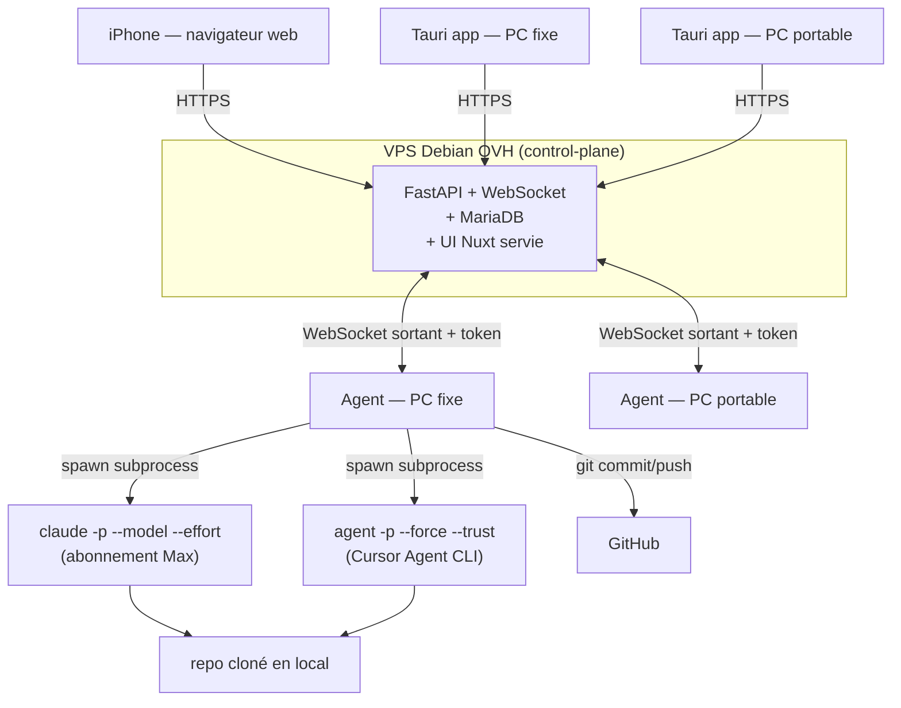

# NightForge — Architecture & Contexte

> **Statut :** V2 implémentée (multi-provider Claude + Cursor, carnet de prompts, lifecycle sidecar).
> **Auteur du besoin :** Léo Guillaume (Dibodev).
> **But de ce document :** figer tout ce qui a été compris et décidé pour retrouver le contexte plus tard et servir de source de vérité.
> **Dernière mise à jour :** 2026-07-18.
> **Suivi V2 :** [`V2_PLAN.md`](./V2_PLAN.md).

---

## 1. En une phrase

**NightForge** est un orchestrateur qui fait travailler **Claude Code et/ou Cursor Agent de façon autonome pendant la nuit / mes absences** (et sert aussi de **carnet de prompts** quand je suis devant le PC), en pilotant intelligemment le **quota Claude Max** (fenêtres de 5 h), en vidant une **file d'attente de prompts par projet**, sur la **machine de mon choix**, le tout pilotable **depuis n'importe quel appareil** **sans VPN**.

---

## 2. Le problème à résoudre

Aujourd'hui, le workflow manuel :

1. Avant de dormir, je lance une grosse tâche à Claude Code.
2. Claude bosse jusqu'à atteindre la limite de quota (~5 h).
3. Quota épuisé → Claude s'arrête.
4. Le lendemain je dois manuellement écrire « continue ».

Je veux **supprimer cette intervention humaine nocturne** et **maximiser l'usage du quota Max** (le brûler pour ne pas le perdre) tout en gardant **la main sur le nombre de quotas** consommés et **la visibilité sur les heures** de reset.

---

## 3. Concepts clés

### 3.1 Le quota Claude Max (à bien comprendre)

Le « quota » n'est **pas** un simple bloc qui se vide et se remplit à heure fixe. Réalité 2026 :

- **Fenêtre glissante (rolling) de 5 h.** Elle démarre à **mon premier message** (pas à minuit), et chaque tranche d'usage vieillit sur sa propre horloge de 5 h → je récupère de la capacité **progressivement**.
- **C'est un `utilization` (float 0.0 → 1.0)**, pas un compteur de prompts. Exposé par l'endpoint interne `GET claude.ai/api/organizations/{org_uuid}/usage`, avec un `resets_at` (timestamp ISO) **par bucket**.
- **Plusieurs buckets simultanés** : `five_hour` (5 h glissantes), `seven_day` (hebdo global), `seven_day_opus` (hebdo Opus, souvent le plus contraignant), `seven_day_oauth_apps` (trafic Claude Code / MCP). **N'importe quel bucket à 1.0 déclenche un 429.**

> ⚠️ **Piège du projet :** faire tourner Claude plusieurs nuits pleines d'affilée peut taper le **plafond hebdomadaire** bien avant le 5 h. NightForge doit surveiller les deux.

**Modèle mental retenu pour le planificateur** (simplification assumée, recalée en direct par l'API) : un **« quota » = une fenêtre de 5 h**. Si je brûle une fenêtre à fond, le prochain gros créneau utilisable arrive ~5 h après le **premier message** de cette fenêtre. Donc consommer **N quotas** ≈ blocs séquentiels de 5 h : bloc N sur `[t0 + (N-1)·5h ; t0 + N·5h]`, et un **quota vierge dispo à `t0 + N·5h`**.

### 3.2 Projet

Un **projet = une référence de dépôt GitHub** (tous mes projets y sont) :
- URL du repo + branche de base.
- Par machine : le chemin du clone local (l'agent clone/pull automatiquement si absent).
- Une **file d'attente de prompts** rattachée.

Pas besoin d'« importer un dossier » manuellement : on référence un repo GitHub, l'agent s'occupe du clone/pull.

### 3.3 File d'attente (queue) — carnet de prompts

Liste ordonnée de **prompts** rattachés à un projet. Chaque entrée :

`{ id, prompt, title?, provider?, model?, effort?, fast_mode?, priorité, statut }`
(`pending → running → done / failed / skipped`).

- **Provider** : `claude` (Claude Code CLI) ou `cursor` (Cursor Agent CLI).
- **Model / effort / fast** : optionnels ; préremplis avec les defaults quotidiens
  (Sonnet→max, Opus→high, Fable→xhigh/Extra, Grok 4.5→high, Composer 2.5→pas d'effort / fast off).
- Sert de **bibliothèque d'idées** : prise de notes pendant qu'un autre prompt tourne,
  copier-coller manuel, ou lancement autonome via le Composer / un run.
- Éditable **en temps réel depuis desktop ET téléphone**.

La file n'est pas forcément exécutée en bloc : l'utilisateur pioche dedans pour composer sa séquence.

### 3.3 bis Messages de nuit (composer chat)

Couche au-dessus de la file : pour chaque projet, l'utilisateur compose une **séquence ordonnée de messages** (comme un chat Claude) qui sera réellement exécutée.

- **Un message** = un envoi à Claude Code (`claude -p`), potentiellement assemblé à partir de **plusieurs prompts** de la bibliothèque (concaténés) ou de texte libre.
- **Ordre libre** : réordonner, éditer, supprimer avant le lancement.
- **Persistance** : les brouillons vivent dans `project_messages` (réutilisables d'une nuit à l'autre, modifiables depuis n'importe quel appareil).
- **Au lancement** : snapshot figé dans `run_messages` ; l'agent exécute **message par message**, pas toute la file d'un coup.
- **Fallback** : si aucun message composé, le run utilise les prompts `pending` de la file (comportement simple).

Interface type Claude :
- **Gauche** : projets sélectionnés pour cette nuit (onglets / liste).
- **Centre** : fil de messages (bulles) + zone de saisie en bas.
- **Droite** : bibliothèque de prompts (file `pending`) avec multi-sélection → « insérer dans le brouillon » ou « créer le message ».

### 3.4 Machine / Agent

Une **machine** = un de mes PC (fixe / portable) faisant tourner l'**agent** NightForge. L'agent :
- se connecte **en sortie** au control-plane (aucun port à ouvrir sur le PC) ;
- s'annonce avec un nom (« Fixe », « Portable ») et un statut en ligne ;
- reçoit les ordres, lance **Claude Code** et/ou **Cursor Agent** **en local**, remonte logs + état ;
- **ne tourne que tant que l'app desktop Tauri est ouverte** (sidecar démarré au launch, `taskkill /T` à la fermeture — pas de service Windows, pas d'autostart).

### 3.5 Run (session de travail nocturne)

Un **run** = une exécution planifiée : `{ machine cible, projet(s), nombre de quotas, heure de lancement, timeline estimée }`. Au lancement, chaque projet embarque sa **séquence de messages composée** (snapshot `run_messages`). C'est l'objet central du dashboard.

---

## 4. Architecture générale

Contrainte structurante : **depuis l'iPhone, j'ouvre juste un site, sans VPN**. Un PC à la maison n'est pas joignable de l'extérieur sans VPN/tunnel. Solution (comme Happy / le Remote Control d'Anthropic) : **les PC se connectent vers l'extérieur**, jamais l'inverse. Le point public unique = **mon VPS**.



### 4.1 Les 3 composants

| Composant | Où | Rôle | Techno |
|-----------|----|------|--------|
| **Control-plane** | VPS Debian OVH (Docker) | API REST + WebSocket, base de données (projets, files, runs, logs, machines), sert l'UI web pour le téléphone | **FastAPI + MariaDB** (mirroir de `devleadhunter/api`) |
| **Agent** | Sur chaque PC (fixe + portable) | Connexion sortante au VPS, lance `claude` / Cursor `agent` en local, surveille le quota Claude, fait les commits/push Git, streame logs & état | **Python** (sidecar Tauri uniquement — mort avec l'app) |
| **UI (web + desktop)** | VPS (web) + chaque PC (desktop) | Même app Nuxt : dashboard, gestion projets/files, lancement de runs, planificateur de quotas | **Nuxt 4** (web) + **Tauri 2** (desktop, auto-updater signé) |

> **Une seule UI Nuxt** écrite une fois → servie en **web** (téléphone / navigateur) et packagée en **desktop Tauri** (pointant `NUXT_PUBLIC_API_BASE` vers le VPS, exactement comme `devleadhunter`).

### 4.2 Pourquoi ce découpage

- Le **VPS** est le seul élément toujours joignable → résout le « piloter depuis le téléphone sans VPN ».
- La **file vit sur le VPS** → je peux **ajouter un prompt depuis le téléphone même PC éteint** ; l'agent le prendra en se reconnectant.
- L'**agent** est le seul à devoir tourner sur une machine avec Claude Code installé + connecté à mon abonnement Max. C'est **le composant nouveau** par rapport à `devleadhunter`.

### 4.3 Alternative écartée

- **Cloudflare Tunnel vers le PC** (zéro serveur) : plus léger mais file locale, PC obligatoirement allumé, synchro multi-machine plus pénible. **Écarté** car j'ai déjà un VPS → autant l'utiliser (gratuit, robuste, centralisé).
- **Anthropic Routines (cloud)** : tournerait PC éteint, mais **pas de contrôle fin du quota Max** (le cœur de mon besoin) → écarté comme solution principale, éventuellement complément plus tard.

---

## 5. Choix « sur quelle machine lancer » (multi-machine)

- Chaque agent s'enregistre auprès du VPS (`machine_id`, nom, statut en ligne, version de Claude Code détectée).
- L'UI liste **les machines en ligne**.
- Au lancement d'un run, je choisis : **machine cible** + **projet(s)** + **nombre de quotas** + heure.
- Un projet peut être clonable sur **plusieurs machines** (chemin local par machine).
- Cas multi-projets : je sélectionne **1 ou plusieurs projets** ; l'agent vide leurs files **prompt par prompt** (séquentiel par défaut ; parallèle possible mais brûle le quota bien plus vite — option assumée puisque « brûler = ne pas perdre »).

---

## 6. Le planificateur de quotas (feature signature)

C'est l'idée maîtresse : **je choisis le nombre de quotas, l'outil me donne la timeline**.

**Entrée :** heure de lancement (maintenant / planifiée) + **nombre de quotas** (1, 2, …) + (optionnel) heure de réveil / dispo.

**Sortie : une timeline claire**, par exemple pour un lancement à **23h00, 2 quotas** :

- Quota 1 : lancé **23h00** → reset **~04h00**
- Quota 2 : lancé **~04h00** → reset **~09h00**
- **Quota vierge dispo : ~09h00**

Exemples cibles (validés) :
- Nuit de **10 h** → 2 quotas de 5 h, ça enchaîne toute la nuit.
- Nuit de **8 h** → 2 quotas, quota vierge ~2 h après le réveil.
- Nuit de **7 h**, **1 quota** → « quota 100 % dispo à ~HH:MM » (dépend de l'heure de départ).

**Recalage en direct :** les heures des quotas 2, 3… sont des **estimations** (fenêtre glissante). L'agent lit le **vrai `resets_at`** via l'API d'usage Anthropic au fil de la nuit et **corrige** la timeline affichée.

**Garde-fou hebdo :** afficher aussi le **budget hebdomadaire restant** (`seven_day`, `seven_day_opus`) pour éviter le mur après plusieurs nuits.

**Info clé demandée :** toujours afficher **« heure estimée du prochain quota vierge disponible »** après les quotas automatiques.

---

## 7. Communication avec Claude Code & Cursor

### Claude Code (Option A — CLI headless)

- `claude -p "<prompt>" --dangerously-skip-permissions` [`--model`] [`--effort`] [`--resume`].
- **Mode abonnement Max obligatoire** : ne JAMAIS passer par `ANTHROPIC_API_KEY`.
- Effort : `low` | `medium` | `high` | `xhigh` (Extra) | `max`.

### Cursor Agent (CLI headless)

- `agent -p --force --trust --approve-mcps --workspace <repo> [--model …] "<prompt>"`.
- Binaire configurable via `NF_CURSOR_BIN` (défaut `agent` / `agent.cmd` sur Windows).
- Fast / effort passés via la syntaxe params du `--model` quand applicable.
- Les messages Cursor **ne consomment pas** le planner de quotas Claude Max.

### Runs mixtes

Un même run peut enchaîner des messages Claude et Cursor (choix par message via `provider`).

---

## 8. Gestion Git

Avant chaque run (par projet) :
- vérifier que le repo est propre (sinon stash / abort selon config) ;
- si `push_to_main` : checkout de la branche de base (`main`…) et push dessus ;
- sinon : créer une **branche dédiée** `night/AAAA-MM-JJ` depuis la branche de base.

Pendant le travail :
- **commits réguliers** (format conventional : `feat:`, `fix:`, `refactor:`…), après chaque prompt terminé ou par intervalle.

À la fin :
- **push automatique** de la branche active sur GitHub ;
- **résumé des changements** (liste des commits, prompts traités, échecs) disponible au réveil.

---

## 9. Machine à états de l'agent & gestion des erreurs

**États :** `idle` → `working` → `waiting_quota` → (`working` | `stopped`) ; `error` transversal.

Détection & réaction :

| Situation | Détection | Réaction |
|-----------|-----------|----------|
| **Quota dépassé (429)** | sortie Claude / lecture API usage | passer `waiting_quota`, lire `resets_at`, attendre, reprendre auto (`--resume`) |
| **Erreur réseau** | timeout / erreur connexion | retry avec backoff exponentiel |
| **Claude bloqué / stall** | pas de sortie / pas de changement fichier pendant X min | relancer ou passer au prompt suivant, logguer |
| **Demande d'autorisation** | prompt interactif détecté | `--dangerously-skip-permissions` en amont ; sinon marquer `failed` |
| **Erreur Git** | code retour git ≠ 0 | logguer, tenter résolution simple, sinon stopper le projet |
| **Crash** | process mort | heartbeat + relance, error budget (stop après N échecs) |

Sécurités : **error budget** (stop auto après N erreurs), **fin de fenêtre autorisée** (ne pas démarrer un nouveau quota au-delà), **kill switch** depuis l'UI (arrêt immédiat).

---

## 10. Modèle de données (control-plane, indicatif)

| Table | Champs clés |
|-------|-------------|
| `users` | auth du dashboard (au moins moi ; pensé multi-user comme devleadhunter) |
| `machines` | `id`, `name`, `user_id`, `last_seen_at`, `online`, `claude_version`, `cursor_version`, `agent_version` |
| `projects` | `id`, `user_id`, `name`, `github_repo`, `base_branch`, `push_to_main` |
| `project_machine_paths` | `project_id`, `machine_id`, `local_path` |
| `queue_items` | `id`, `project_id`, `prompt`, `title`, `provider`, `model`, `effort`, `fast_mode`, `priority`, `status`, `created_from` — carnet de prompts |
| `project_messages` | `id`, `project_id`, `order_index`, `content`, `provider`, `claude_model`, `effort`, `fast_mode`, `claude_session_id`, `source_item_ids`, `created_from` |
| `runs` | `id`, `machine_id`, `status`, `quota_count`, `started_at`, `window_end`, `planned_timeline` (JSON) |
| `run_projects` | `run_id`, `project_id` (multi-projets) |
| `run_messages` | snapshot exécuté : content + provider/model/effort/fast + `status` / `error` |
| `run_events` / `logs` | `run_id`, `ts`, `level`, `message` |
| `quota_snapshots` | `machine_id`, `ts`, buckets `five_hour` / `seven_day` / `seven_day_opus`… (`utilization`, `resets_at`) |
| `commits` | `run_id`, `project_id`, `sha`, `message`, `pushed_at` |

*(Schéma indicatif — à affiner à l'implémentation. Toutes les ressources scopées par `user_id`.)*

---

## 11. Stack technique (alignée sur devleadhunter)

Monorepo, mêmes conventions que `devleadhunter` :

```
nightforge/
  api/         # FastAPI + MariaDB (control-plane) — pattern devleadhunter/api
  web/         # Nuxt 4 + Tauri 2 (UI web + desktop) — pattern devleadhunter/web
  agent/       # Agent Python (nouveau) — tourne sur chaque PC
  docker-compose.yml
  .github/workflows/  # deploy-api, deploy-web, desktop-release (Tauri)
```

| Couche | Techno | Notes (repris de devleadhunter) |
|--------|--------|------------------------------|
| Control-plane | **FastAPI**, Pydantic v2, SQLAlchemy, **MariaDB** | Docker (`docker-compose.yml`), phpMyAdmin en dev, migrations manuelles, déployé sur VPS via CI |
| Realtime | **WebSocket** (FastAPI) | agents ↔ VPS ↔ UI (état/logs live) |
| UI | **Nuxt 4**, Vue 3.5, **TypeScript strict**, Pinia, **Nuxt UI v4**, Tailwind v4, i18n, icônes **lucide** | drawers persistants (pile Pinia), palette Ctrl+K si pertinent |
| Desktop | **Tauri 2** + `NUXT_DESKTOP_BUILD=1 nuxt generate`, **auto-updater signé** (minisign), CI Windows | `NUXT_PUBLIC_API_BASE` → VPS, version `0.1.${run_number}` |
| Agent | **Python** (subprocess pour `claude` / Cursor `agent` & `git`, httpx pour l'API usage, websockets) | **packagé en sidecar Tauri, lancé par l'app desktop au démarrage** (arrêté à la fermeture avec `taskkill /T`) ; tick idle 60 s / working 30 s |
| Base | **MariaDB** (VPS) | cohérent avec mon ops actuel (> SQLite ; gratuit sur mon VPS) |
| Qualité | husky + commitlint conventional, lint front (prettier + eslint + vue-tsc) | [`STANDARDS_CODE_ET_ARCHITECTURE.md`](./STANDARDS_CODE_ET_ARCHITECTURE.md) |

**Recommandations retenues :**
- **DB = MariaDB** (reprend ton stack/ops ; SQLite possible mais MariaDB = zéro friction chez toi).
- **Control-plane = FastAPI** (reprend `devleadhunter/api`).
- **Agent = Python** ✅ **décidé** (même langage que l'API, subprocess/git triviaux, réutilise les workers existants de devleadhunter). Rust écarté : plus léger/natif Tauri mais non pratiqué → maintenance plus dure pour un gain marginal.
- **Packaging agent = sidecar Tauri lancé par l'app desktop** ✅ **décidé** (un seul exécutable ; mort avec l'app ; pas de service Windows).

---

## 12. Sécurité

- **Auth du dashboard** (login) — obligatoire car exposé publiquement sur le VPS.
- **HTTPS** partout (reverse proxy VPS).
- **Token par agent** pour l'authentification WebSocket agent → VPS.
- **Secrets en variables d'environnement** (jamais en clair) ; chiffrement des secrets sensibles côté control-plane (pattern `encryption_service` de devleadhunter).
- L'agent lance Claude en **mode abonnement** (pas de clé API stockée).
- Kill switch + error budget pour éviter tout emballement nocturne.

---

## 13. Interfaces

### Dashboard (web + desktop, même UI)
- **Compositeur de nuit** (écran principal) : layout 3 colonnes type chat — projets à gauche, messages au centre, bibliothèque de prompts à droite ; estimation quotas + lancement en barre supérieure.
- **État courant** par machine : `idle` / `working` / `waiting_quota` / `error`.
- **Run en cours** : projet(s), message courant, progression de la séquence.
- **Timeline quotas** : quotas lancés/à venir + heure du prochain quota vierge + budget hebdo.
- **Logs Claude** en direct.
- **Historique** des runs (commits, messages traités, échecs, résumé).

### Mobile (même app en web responsive)
Depuis le téléphone, sans VPN : gérer la bibliothèque de prompts, **composer les messages** par projet (drawer bibliothèque), choisir machine + quotas, **lancer** un run, **arrêter** (kill switch), suivre logs & progression des messages.

---

## 14. Décisions

**Actées (2026-07-11 + V2 2026-07-18) :**

1. ✅ **Langage de l'agent = Python** (cohérent avec l'API FastAPI, subprocess `claude`/`agent`/`git` triviaux).
2. ✅ **Packaging de l'agent = sidecar Tauri lancé par l'app desktop** : démarré au launch, **tué en arbre (`taskkill /F /T`) à la fermeture**, anti-respawn (`shutting_down`). Pas de service Windows / autostart.
3. ✅ **Multi-provider** : Claude Code + Cursor Agent CLI, métadonnées par message, runs mixtes.
4. ✅ **File d'attente = carnet de prompts** (prise de notes + lancement).

**Encore ouvertes (à trancher au fil de l'implémentation, valeurs par défaut posées) :**

5. **Parallélisme multi-projets** : séquentiel par défaut ; exposer une option parallèle ?
6. **Réveil du PC en veille** (Windows Task Scheduler wake) vs « je laisse le PC allumé ». → défaut : PC allumé.
7. **Nom de branche** : `night/AAAA-MM-JJ` global vs par projet.
8. **Lecture du quota** : endpoint `.../usage` officieux — prévoir un fallback.
9. **Quota planner Cursor** : hors scope V2.

---

## 15. Étapes d'implémentation proposées (phasage, sans coder encore)

1. **Fondations monorepo** : `api/` (FastAPI + MariaDB + Docker) + `web/` (Nuxt 4) + `agent/` (Python), CI de base, standards/husky.
2. **Boucle agent minimale** : agent ↔ VPS (WebSocket + token), enregistrement machine, spawn `claude -p` sur un projet, remontée de logs.
3. **Files & projets** : CRUD projets (repo GitHub), files de prompts, édition web + mobile temps réel.
4. **Planificateur de quotas** : lecture API usage, timeline estimée + recalage live, garde-fous hebdo.
5. **Git** : branche dédiée, commits réguliers, push, résumé de run.
6. **Gestion erreurs/retry** + machine à états complète + kill switch.
7. **Desktop Tauri** : packaging, auto-updater signé (CI Windows), autostart de l'agent.
8. **Dashboard** complet + polish mobile + auth/sécurité.

---

## 16. Références (état de l'art consulté, 2026)

Outils existants étudiés (pour inspiration ; on construit sur-mesure) :
- **Anthropic** : *Routines* (`/schedule`, cloud, PC éteint) et *Remote Control* (piloter une session locale depuis le téléphone, 25 fév. 2026).
- **`claude-nightshift` (dujunyi416)** : quota-aware, pre-warm de la fenêtre 5 h, queue, auto-resume, réveil PC (Windows), tray + panneau web. → le plus proche du besoin nocturne.
- **`claude-code-scheduler` (jshchnz)** : cross-platform, git worktree isolé, auto-push.
- **`NightShift` (moinsen-dev)** : worker autonome overnight/24x7, error budget, sandbox, heartbeat.
- **`autonomous-claude-queue` (albertnahas)** : queue via Stop hook, circuit breaker.
- **Happy** : client mobile open-source pour Claude Code (daemon multi-projets, notifs push, E2E). → inspiration pour la partie « pilotage mobile ».
- **Vibe Kanban** : board multi-agents (en sunsetting/communautaire).

**Mécanique quota (sources)** : fenêtre 5 h glissante démarrant au 1er message ; `utilization` float par bucket via `GET claude.ai/api/organizations/{org_uuid}/usage` ; buckets `five_hour`, `seven_day`, `seven_day_opus`, `seven_day_oauth_apps`.
